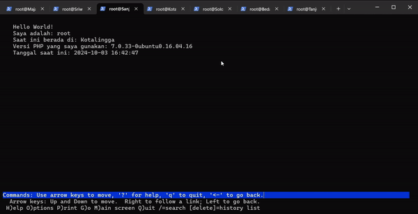

# Jarkom-Modul-2-2024-IT12

## Kelompok IT12
### Anggota Kelompok :
|             Nama              |     NRP    |
|-------------------------------|------------|
| Azza Farichi Tjahjono         | 5027231071 |
| Aisyah Rahmasari              | 5027231072 |

## Topologi


## Setup Jaringan

- Pada **Nusantara** :
    - klik kanan lalu pilih `configure`, Scroll lalu klik pada `Network Configuration`
    - Isi dengan config berikut :
        ```
        auto eth0
        iface eth0 inet dhcp

        auto eth1
        iface eth1 inet static
            address 192.239.1.1
            netmask 255.255.255.0

        auto eth2
        iface eth2 inet static
            address 192.239.2.1
            netmask 255.255.255.0

        auto eth3
        iface eth3 inet static
            address 192.239.3.1
            netmask 255.255.255.0
        ```
- Pada **Node** lain:
    - Masukkan config berikut pada setiap node
    - Pastikan **gateaway** sesuai dengan node sebelumnya
    - Untuk **address** sesuaikan, jangan sampai ada yang sama dengan node sebelumnya
        ```
        auto eth0
        iface eth0 inet static
            address 192.239.1.3
            netmask 255.255.255.0
            gateway 192.239.1.1
        ```


## Langkah-Langkah


### Nomor 1
**Soal:**
> Untuk mempersiapkan peperangan World War MMXXIV (Iya sebanyak itu), Sriwijaya membuat dua kotanya menjadi web server yaitu Tanjungkulai, dan Bedahulu, serta Sriwijaya sendiri akan menjadi DNS Master. Kemudian karena merasa terdesak, Majapahit memberikan bantuan dan menjadikan kerajaannya (Majapahit) menjadi DNS Slave.

**Script / Config :**

**Tambahkan juga konfigurasi berikut di Nusantara (Router) agar semua node di jaringan bisa mengakses internet luar :**
- ```
  iptables -t nat -A POSTROUTING -o eth0 -j MASQUERADE -s 192.239.0.0/16
  ```
  
**Ubah nameserver di Sriwijaya dengan menggunakan IP nameserver Nusantara :**
- ```
  echo nameserver 192.168.122.1 > /etc/resolv.conf
  cat /etc/resolv.conf
  ```

**Install Bind9 pada Sriwijaya**
- ```
  apt-get update
  apt-get install bind9 -y
  ```

**Testing pada semua node** :

   - Lakukan ping pada `semua node` dengan perintah `ping google.com`
     

     

     

     

     

     


### Nomor 2
**Soal:**
> Karena para pasukan membutuhkan koordinasi untuk melancarkan serangannya, maka buatlah sebuah domain yang mengarah ke Solok dengan alamat sudarsana.xxxx.com dengan alias www.sudarsana.xxxx.com, dimana xxxx merupakan kode kelompok. Contoh: sudarsana.it01.com.

**Script / Config :**

**Jalankan perintah berikut untuk memperbarui paket dan menginstal Bind9 :**
- ```bash
  apt-get update
  apt-get install bind9 -y
  ```

**Menjalankan service Bind9 :**
- ```bash
  service bind9 start
  ```

**Tambahkan baris berikut pada file `setup.sh` untuk mengonfigurasi zona DNS :**
- ```bash
  elif [[ $1 == "dns-master" ]]; then
    echo "Configuring DNS resolver..."
    echo "nameserver 192.168.122.1" > /etc/resolv.conf

    echo "Updating system..."
    apt-get update

    echo "Installing BIND9..."
    apt-get install -y bind9

    echo "Menambahkan konfigurasi zona sudarsono.it12.com ke /etc/bind/named.conf.local..."
    echo 'zone "sudarsana.it12.com" {' >> /etc/bind/named.conf.local
    echo '    type master;' >> /etc/bind/named.conf.local
    echo '    notify yes;' >> /etc/bind/named.conf.local
    echo '    also-notify { 192.239.2.2; }; // IP Majapahit' >> /etc/bind/named.conf.local
    echo '    allow-transfer { 192.239.2.2; }; // IP Majapahit' >> /etc/bind/named.conf.local
    echo '    file "/etc/bind/db.sudarsana.it12.com";' >> /etc/bind/named.conf.local
    echo '};' >> /etc/bind/named.conf.local

    cp /etc/bind/db.local /etc/bind/db.sudarsana.it12.com
  ```

**Tambahkan DNS record berikut :**
- ```bash
  echo ';' > /etc/bind/db.sudarsana.it12.com
    echo '; BIND data file for local loopback interface' >> /etc/bind/db.sudarsana.it12.com
    echo ';' >> /etc/bind/db.sudarsana.it12.com
    echo '$TTL    604800' >> /etc/bind/db.sudarsana.it12.com
    echo '@       IN      SOA     sudarsana.it12.com. root.sudarsana.it12.com. (' >> /etc/bind/db.sudarsana.it12.com
    echo '                        2024050301      ; Serial' >> /etc/bind/db.sudarsana.it12.com
    echo '                        604800         ; Refresh' >> /etc/bind/db.sudarsana.it12.com
    echo '                        86400          ; Retry' >> /etc/bind/db.sudarsana.it12.com
    echo '                        2419200        ; Expire' >> /etc/bind/db.sudarsana.it12.com
    echo '                        604800 )       ; Negative Cache TTL' >> /etc/bind/db.sudarsana.it12.com
    echo ';' >> /etc/bind/db.sudarsana.it12.com
    echo '@       IN      NS      sudarsana.it12.com.' >> /etc/bind/db.sudarsana.it12.com
    echo '@       IN      A       192.239.3.2     ; IP Solok' >> /etc/bind/db.sudarsana.it12.com
    echo 'www     IN      CNAME   sudarsana.it12.com.' >> /etc/bind/db.sudarsana.it12.com
    echo 'cakra   IN      A       192.239.1.5     ; IP Bedahulu' >> /etc/bind/db.sudarsana.it12.com
  ```

**Setelah konfigurasi selesai, restart Bind9 :**
- ```bash
  service bind9 restart
  ```

**Testing pada semua client** :

   - Lakukan ping pada `semua client` dengan perintah `ping sudarsana.it12.com`

     

     

     


### Nomor 3
**Soal:**
> Para pasukan juga perlu mengetahui mana titik yang akan diserang, sehingga dibutuhkan domain lain yaitu pasopati.xxxx.com dengan alias www.pasopati.xxxx.com yang mengarah ke Kotalingga.

**Script / Config :**

**Jalankan perintah berikut untuk memperbarui paket dan menginstal Bind9 :**
- ```bash
  apt-get update
  apt-get install bind9 -y
  ```

**Menjalankan service Bind9 :**
- ```bash
  service bind9 start
  ```

**Tambahkan baris berikut pada file `setup.sh` untuk mengonfigurasi zona DNS :**
- ```bash
  # menambah pasopati
    echo "Menambahkan konfigurasi zona pasopati.it12.com ke /etc/bind/named.conf.local..."
    echo 'zone "pasopati.it12.com" {' >> /etc/bind/named.conf.local
    echo '    type master;' >> /etc/bind/named.conf.local
    echo '    notify yes;' >> /etc/bind/named.conf.local
    echo '    also-notify { 192.239.2.2; }; // IP Majapahit' >> /etc/bind/named.conf.local
    echo '    allow-transfer { 192.239.2.2; }; // IP Majapahit' >> /etc/bind/named.conf.local
    echo '    file "/etc/bind/db.pasopati.it12.com";' >> /etc/bind/named.conf.local
    echo '};' >> /etc/bind/named.conf.local

    cp /etc/bind/db.local /etc/bind/db.pasopati.it12.com
  ```

**Tambahkan DNS record berikut :**
- ```bash
  echo ';' > /etc/bind/db.pasopati.it12.com
    echo '; BIND data file for local loopback interface' >> /etc/bind/db.pasopati.it12.com
    echo ';' >> /etc/bind/db.pasopati.it12.com
    echo '$TTL    604800' >> /etc/bind/db.pasopati.it12.com
    echo '@       IN      SOA     pasopati.it12.com. root.pasopati.it12.com. (' >> /etc/bind/db.pasopati.it12.com
    echo '                        2024050301      ; Serial' >> /etc/bind/db.pasopati.it12.com
    echo '                        604800         ; Refresh' >> /etc/bind/db.pasopati.it12.com
    echo '                        86400          ; Retry' >> /etc/bind/db.pasopati.it12.com
    echo '                        2419200        ; Expire' >> /etc/bind/db.pasopati.it12.com
    echo '                        604800 )       ; Negative Cache TTL' >> /etc/bind/db.pasopati.it12.com
    echo ';' >> /etc/bind/db.pasopati.it12.com
    echo '@       IN      NS      pasopati.it12.com.' >> /etc/bind/db.pasopati.it12.com
    echo '@       IN      A       192.239.2.4     ; IP Kotalingga' >> /etc/bind/db.pasopati.it12.com
    echo 'www     IN      CNAME   pasopati.it12.com.' >> /etc/bind/db.pasopati.it12.com
    echo 'ns1     IN      A       192.239.2.2     ; IP Majapahit' >> /etc/bind/db.pasopati.it12.com
    echo 'panah   IN      NS      ns1' >> /etc/bind/db.pasopati.it12.com
  ```

**Setelah konfigurasi selesai, restart Bind9 berikut:**
- ```bash
  service bind9 restart
  ```

**Testing pada semua client** :

   - Lakukan ping pada `semua client` dengan perintah `ping pasopati.it12.com`

     

     

     


### Nomor 4
**Soal:**
> Markas pusat meminta dibuatnya domain khusus untuk menaruh informasi persenjataan dan suplai yang tersebar. Informasi dan suplai meme terbaru tersebut mengarah ke Tanjungkulai dan domain yang ingin digunakan adalah rujapala.xxxx.com dengan alias www.rujapala.xxxx.com.

**Script / Config :**

**Jalankan perintah berikut untuk memperbarui paket dan menginstal Bind9 :**
- ```bash
  apt-get update
  apt-get install bind9 -y
  ```

**Menjalankan service Bind9 :**
- ```bash
  service bind9 start
  ```
  
**Tambahkan baris berikut pada file `setup.sh` untuk mengonfigurasi zona DNS :**
- ```bash
  # menambah rujapala
    echo "Menambahkan konfigurasi zona rujapala.it12.com ke /etc/bind/named.conf.local..."
    echo 'zone "rujapala.it12.com" {' >> /etc/bind/named.conf.local
    echo '    type master;' >> /etc/bind/named.conf.local
    echo '    notify yes;' >> /etc/bind/named.conf.local
    echo '    also-notify { 192.239.2.2; }; // IP Majapahit' >> /etc/bind/named.conf.local
    echo '    allow-transfer { 192.239.2.2; }; // IP Majapahit' >> /etc/bind/named.conf.local
    echo '    file "/etc/bind/db.rujapala.it12.com";' >> /etc/bind/named.conf.local
    echo '};' >> /etc/bind/named.conf.local

    cp /etc/bind/db.local /etc/bind/db.rujapala.it12.com
  ```

**Tambahkan DNS record berikut :**
- ```bash
  echo ';' > /etc/bind/db.rujapala.it12.com
    echo '; BIND data file for local loopback interface' >> /etc/bind/db.rujapala.it12.com
    echo ';' >> /etc/bind/db.rujapala.it12.com
    echo '$TTL    604800' >> /etc/bind/db.rujapala.it12.com
    echo '@       IN      SOA     rujapala.it12.com. root.rujapala.it12.com. (' >> /etc/bind/db.rujapala.it12.com
    echo '                        2024050301      ; Serial' >> /etc/bind/db.rujapala.it12.com
    echo '                        604800         ; Refresh' >> /etc/bind/db.rujapala.it12.com
    echo '                        86400          ; Retry' >> /etc/bind/db.rujapala.it12.com
    echo '                        2419200        ; Expire' >> /etc/bind/db.rujapala.it12.com
    echo '                        604800 )       ; Negative Cache TTL' >> /etc/bind/db.rujapala.it12.com
    echo ';' >> /etc/bind/db.rujapala.it12.com
    echo '@       IN      NS      rujapala.it12.com.' >> /etc/bind/db.rujapala.it12.com
    echo '@       IN      A       192.239.1.4     ; IP Tanjungkulai' >> /etc/bind/db.rujapala.it12.com
    echo 'www     IN      CNAME   rujapala.it12.com.' >> /etc/bind/db.rujapala.it12.com
  ```

**Setelah konfigurasi selesai, restart Bind9 :**
- ```bash
  service bind9 restart
  ```

**Testing pada semua client** :

   - Lakukan ping pada `semua client` dengan perintah `ping rujapala.it12.com`

     

     

     


### Nomor 5
**Soal:**
> Pastikan domain-domain tersebut dapat diakses oleh seluruh komputer (client) yang berada di Nusantara.

**Script / Config :**

**Pastikan bahwa semua domain yang telah dikonfigurasi dapat diakses oleh seluruh komputer (klien) yang terhubung di jaringan Nusantara, lakukan pengujian berupa penggunaan perintah ping**
**Testing pada semua client** :

   - Lakukan test ptr pada `semua client` dengan perintah berikut ini :
   - ```bash
     ping sudarsana.it12.com
     ping pasopati.it12.com
     ping rujapala.it12.com
     ```
     

     

     

### Nomor 6
**Soal:**
> Beberapa daerah memiliki keterbatasan yang menyebabkan hanya dapat mengakses domain secara langsung melalui alamat IP domain tersebut. Karena daerah tersebut tidak diketahui secara spesifik, pastikan semua komputer (client) dapat mengakses domain pasopati.xxxx.com melalui alamat IP Kotalingga (Notes: menggunakan pointer record).

**Script / Config :**

**Untuk mengatur reverse DNS, ambil tiga angka pertama dari alamat IP server kami dan susun kembali. Maka hasil reverse-nya akan menjadi 2.239.192. Masukkan script pada file `setup.sh` :**
- ```bash
  # Menambahkan REVERSE DNS
    echo "configure reverse dns..."
    echo 'zone "2.239.192.in-addr.arpa" {
        type master;
        file "/etc/bind/db.2.239.192.in-addr.arpa";
    };' >> /etc/bind/named.conf.local

    cp /etc/bind/db.local /etc/bind/db.2.239.192.in-addr.arpa

    echo ';' > /etc/bind/db.2.239.192.in-addr.arpa
    echo '; BIND data file for local loopback interface' >> /etc/bind/db.2.239.192.in-addr.arpa
    echo ';' >> /etc/bind/db.2.239.192.in-addr.arpa
    echo '$TTL    604800' >> /etc/bind/db.2.239.192.in-addr.arpa
    echo '@       IN      SOA     pasopati.it12.com. root.pasopati.it12.com. (' >> /etc/bind/db.2.239.192.in-addr.arpa
    echo '                        2024050301      ; Serial' >> /etc/bind/db.2.239.192.in-addr.arpa
    echo '                        604800         ; Refresh' >> /etc/bind/db.2.239.192.in-addr.arpa
    echo '                        86400          ; Retry' >> /etc/bind/db.2.239.192.in-addr.arpa
    echo '                        2419200        ; Expire' >> /etc/bind/db.2.239.192.in-addr.arpa
    echo '                        604800 )       ; Negative Cache TTL' >> /etc/bind/db.2.239.192.in-addr.arpa
    echo ';' >> /etc/bind/db.2.239.192.in-addr.arpa
    echo '2.239.192.in-addr.arpa.    IN      NS      pasopati.it12.com.' >> /etc/bind/db.2.239.192.in-addr.arpa
    echo '4                       IN      PTR     pasopati.it12.com.' >> /etc/bind/db.2.239.192.in-addr.arpa


    echo "Restarting bind9 service..."
    service bind9 restart

    echo "DNS Master server setup completed."
  ```

**Lakukan testing pada `client` dengan perintah berikut ini :**
- ```bash
  host -t PTR 192.239.2.4
  ```

  
  
  

  

### Nomor 7
**Soal:**
> Akhir-akhir ini seringkali terjadi serangan brainrot ke DNS Server Utama, sebagai tindakan antisipasi kamu diperintahkan untuk membuat DNS Slave di Majapahit untuk semua domain yang sudah dibuat sebelumnya yang mengarah ke Sriwijaya.

**Script / Config :**

- pada **Sriwijaya** :

    - `nano /etc/bind/named.conf.local`

    - lalu tambahkan :
        ```bash
        zone "sudarsana.it12.com" {
            type master;
            notify yes;
            also-notify { 192.239.2.2; }; // IP Majapahit
            allow-transfer { 192.239.2.2; }; // IP Majapahit
            file "/etc/bind/db.sudarsana.it12.com";
        };

        zone "pasopati.it12.com" {
            type master;
            notify yes;
            also-notify { 192.239.2.2; }; // IP Majapahit
            allow-transfer { 192.239.2.2; }; // IP Majapahit
            file "/etc/bind/db.pasopati.it12.com";
        };

        zone "rujapala.it12.com" {
            type master;
            notify yes;
            also-notify { 192.239.2.2; }; // IP Majapahit
            allow-transfer { 192.239.2.2; }; // IP Majapahit
            file "/etc/bind/db.rujapala.it12.com";
        };

        ```

    - Lalu restart bind service
        ```bash
        service bind0 restart
        ```

- Pada **Majapahit** :

    -   ```bash
        nano /etc/bind/named.conf.local
        ```
    
    - Lalu tambahkan juga :
        ```bash
        zone "sudarsana.it12.com" {
            type slave;
            masters { 192.239.1.3; }; // IP Sriwijaya
            file "/var/lib/bind/sudarsana.it12.com";
        };

        zone "pasopati.it12.com" {
            type slave;
            masters { 192.239.1.3; }; // IP Sriwijaya
            file "/var/lib/bind/pasopati.it12.com";
        };

        zone "rujapala.it12.com" {
            type slave;
            masters { 192.239.1.3; }; // IP Sriwijaya
            file "/var/lib/bind/rujapala.it12.com";
        };

        ```
    - Lalu restart bind service
        ```bash
        service bind0 restart
        ```

**Testing pada client**:

- Pada **Sriwijaya** matikan service dari bind
    ```bash
    service bind9 stop
    ```

- Lakukan ping domain pada **client**:
    


### Nomor 8
**Soal:**
> Kamu juga diperintahkan untuk membuat subdomain khusus melacak kekuatan tersembunyi di Ohio dengan subdomain cakra.sudarsana.xxxx.com yang mengarah ke Bedahulu.

**Script / Config :**

- Pada **Sriwijaya** :
    -   ```
        nano /etc/bind/db.sudarsana.it12.com
        ```
    - Masukkan config berikut pada line paling bawah :
        ```
        cakra   IN      A       192.239.1.5     ; IP Bedahulu
        ```
    - Restart service bind
        ```
        service bind9 restart
        ```
**Testing pada client** :
- Pada client coba `ping cakra.sudarsana.it12.com`
    

### Nomor 9
**Soal:**
> Karena terjadi serangan DDOS oleh shikanoko nokonoko koshitantan (NUN), sehingga sistem komunikasinya terhalang. Untuk melindungi warga, kita diperlukan untuk membuat sistem peringatan dari siren man oleh Frekuensi Freak dan memasukkannya ke subdomain panah.pasopati.xxxx.com dalam folder panah dan pastikan dapat diakses secara mudah dengan menambahkan alias www.panah.pasopati.xxxx.com dan mendelegasikan subdomain tersebut ke Majapahit dengan alamat IP menuju radar di Kotalingga.

**Script / Config :**

- Pada **Sriwijaya** :
    -   ```bash
        nano /etc/bind/db.pasopati.it12.com
        ```
    - Tambahkan line berikut ke barisan paling bawah file `db.pasopati.it12.com` :
        ```
        ns1     IN      A       192.239.2.2     ; IP Majapahit
        panah   IN      NS      ns1
        ```
    -   Lalu ketik
        ```bash
        nano /etc/bind/named.conf.options
        ```
    - Masukkan :
        ```
        options {
                    directory "/var/cache/bind";
                    allow-query{any;};
                    auth-nxdomain no;    # conform to RFC1035
                    listen-on-v6 { any; };
            };
        ```
    - Restart service bind
        ```
        service bind9 restart
        ```
- Pada **Majapahit** :
    - buat folder baru bernama `panah`
        ```bash
        mkdir /etc/bind/panah
        ```
    - buka `named.conf.options`
        ```
        nano /etc/bind/named.conf.options
        ```
    - Masukkan :
        ```
        options {
                    directory "/var/cache/bind";
                    allow-query{any;};
                    auth-nxdomain no;    # conform to RFC1035
                    listen-on-v6 { any; };
            };
        ```
    - Lalu buka `named.conf.local`
        ```
        nano /etc/bind/named.conf.local
        ```
    - Masukkan :
        ```
        zone "panah.pasopati.it12.com" {
                type master;
                file "/etc/bind/panah/panah.pasopati.it12.com";
        };
        ```
    - Lalu copy file `db.local` menjadi `panah.pasopati.it12.com`
        ```
        cp /etc/bind/db.local /etc/bind/panah/panah.pasopati.it12.com
        ```
    - Ganti dengan konfigurasi berikut :
        ```
        ;
        ; BIND data file for local loopback interface
        ;
        $TTL    604800
        @       IN      SOA     panah.pasopati.it12.com. root.panah.pasopati.it12.com. (
                                2         ; Serial
                            604800         ; Refresh
                            86400         ; Retry
                            2419200         ; Expire
                            604800 )       ; Negative Cache TTL
        ;
        @       IN      NS      panah.pasopati.it12.com.
        @       IN      A       192.239.2.4     ; IP Kotalingga
        www     IN      CNAME   panah.pasopati.it12.com.
        ```
    - Restart service bind
        ```
        service bind9 restart
        ```
**Testing pada client** :
- Lakukan ping pada `panah.pasopati.it12.com` pada client
    


### Nomor 10
**Soal:**
> Markas juga meminta catatan kapan saja meme brain rot akan dijatuhkan, maka buatlah subdomain baru di subdomain panah yaitu log.panah.pasopati.xxxx.com serta aliasnya www.log.panah.pasopati.xxxx.com yang juga mengarah ke Kotalingga.

**Script / Config :**

- Pada **Majapahit** :
    - Masuk ke file `panah.pasopati.it12.com`
        ```
        nano /etc/bind/panah/panah.pasopati.it12.com
        ```
    - Tambahkan line berikut pada barisan paling bawah :
        ```
        log     IN      A       192.239.2.4     ; IP Kotalingga
        www.log IN      CNAME   panah.pasopati.it12.com.
        ```
    - Restart service bind
        ```
        service bind9 restart
        ```
**Testing pada client** :
- lakukan ping pada `log.panah.pasopati.it12.com` dan `www.log.panah.pasopati.it12.com`
    

### Nomor 11
**Soal:**
> Setelah pertempuran mereda, warga IT dapat kembali mengakses jaringan luar dan menikmati meme brainrot terbaru, tetapi hanya warga Majapahit saja yang dapat mengakses jaringan luar secara langsung. Buatlah konfigurasi agar warga IT yang berada diluar Majapahit dapat mengakses jaringan luar melalui DNS Server Majapahit.

**Script / Config :**

- Pada **Sriwijaya** dan **Majapahit** :
    - buka file `named.conf.options`
        ```
        nano /etc/bind/named.conf.options
        ```
    - Ganti isi nya menjadi :
        ```
        options {
                    directory "/var/cache/bind";
                    allow-query{any;};
                    forwarders {
                        192.168.122.1; //IP Erangel
                    };
                    auth-nxdomain no;    # conform to RFC1035
                    listen-on-v6 { any; };
            };
        ```
    - Restart service bind
        ```
        service bind9 restart
        ```
**Testing pada client** :
- pastikan pada `/etc/resolve.conf` tidak ada `nameserver 192.168.122.1`

    

- coba `ping google.com`

    

### Nomor 12
**Soal:**
> Karena pusat ingin sebuah laman web yang ingin digunakan untuk memantau kondisi kota lainnya maka deploy laman web ini (cek resource yg lb) pada Kotalingga menggunakan apache.

**Script / Config :**

- Pada **Kotalingga** : 
    - install `apache2`, `libapache2-mod-php7.0`, `unzip`, `php`
    - Download file yang diminta dari google drive dengan menggunakan `curl`
        ```
        curl -L -o lb.zip --insecure "https://drive.google.com/uc?export=download&id=1Sqf0TIiybYyUp5nyab4twy9svkgq8bi7"
        ```
    - Lalu unzip file yang di download
    - Lalu copy file di dalam folder worker ke dalam `/var/www/html/`
        ```
        cp worker/index.php /var/www/html/index.php
        ```
    - Restart apache
        ```
        service apache2 restart
        ```

**Testing di client** :
- jalankan `lynx http://192.239.2.4/index.php`
    


### Nomor 13
**Soal:**
> Karena Sriwijaya dan Majapahit memenangkan pertempuran ini dan memiliki banyak uang dari hasil penjarahan (sebanyak 35 juta, belum dipotong pajak) maka pusat meminta kita memasang load balancer untuk membagikan uangnya pada web nya, dengan Kotalingga, Bedahulu, Tanjungkulai sebagai worker dan Solok sebagai Load Balancer menggunakan apache sebagai web server nya dan load balancer nya.

**Script / Config :**

- Pada **Tanjungkulai** dan **Bedahulu** jalankan config seperti pada **nomor 12**

- Pada **Solok** :
    - Install `apache2`, `libapache2-mod-php7.0`, dan `php`
    - Aktifkan module yang di gunakan di apache2 dengan command :
        ```
        a2enmod proxy proxy_balancer proxy_http lbmethod_byrequests
        ```
    - Edit file `/etc/apache2/sites-available/000-default.conf`
        ```
        <VirtualHost *:80>
            <Proxy balancer://servergue>
                BalancerMember http://192.239.1.4/
                BalancerMember http://192.239.1.5/
                BalancerMember http://192.239.2.4/
                Proxyset lbmethod=byrequests
            </Proxy>
            ProxyPass / balancer://servergue/
            ProxyPassReverse / balancer://servergue/
        </VirtualHost>
        ```
    - Restart apache2
        ```
        service apache2 restart
        ```

**Testing di client** :
- Jalankan `lynx http://192.239.3.2/index.php`

    

### Nomor 14
**Soal:**
> Selama melakukan penjarahan mereka melihat bagaimana web server luar negeri, hal ini membuat mereka iri, dengki, sirik dan ingin flexing sehingga meminta agar web server dan load balancer nya diubah menjadi nginx.

**Script / Config :**

[isi langkah-langkah disini]

### Nomor 15
**Soal:**
> Markas pusat meminta laporan hasil benchmark dengan menggunakan apache benchmark dari load balancer dengan 2 web server yang berbeda tersebut dan meminta secara detail dengan ketentuan:
> - Nama Algoritma Load Balancer
> - Rport hasil testing apache benchmark 
> - Grafik request per second untuk masing masing algoritma. 
> - Analisis
> - Meme terbaik kalian (terserah ( ͡° ͜ʖ ͡°)) 🤓

**Script / Config :**

[isi langkah-langkah disini]


### Nomor 16
**Soal:**
> Karena dirasa kurang aman dari brainrot karena masih memakai IP, markas ingin akses ke Solok memakai solok.xxxx.com dengan alias www.solok.xxxx.com (sesuai web server terbaik hasil analisis kalian).

**Script / Config :**

[isi langkah-langkah disini]

### Nomor 17
**Soal:**
> Agar aman, buatlah konfigurasi agar solok.xxx.com hanya dapat diakses melalui port sebesar π x 10^4 = (phi nya desimal) dan 2000 + 2000 log 10 (10) +700 - π = ?.

**Script / Config :**

[isi langkah-langkah disini]

### Nomor 18
**Soal:**
> Apa bila ada yang mencoba mengakses IP solok akan secara otomatis dialihkan ke www.solok.xxxx.com.

**Script / Config :**

[isi langkah-langkah disini]

### Nomor 19
**Soal:**
> Karena probset sudah kehabisan ide masuk ke salah satu worker buatkan akses direktori listing yang mengarah ke resource worker2.

**Script / Config :**

[isi langkah-langkah disini]

### Nomor 20
**Soal:**
> Worker tersebut harus dapat di akses dengan sekiantterimakasih.xxxx.com dengan alias www.sekiantterimakasih.xxxx.com.

**Script / Config :**

[isi langkah-langkah disini]
